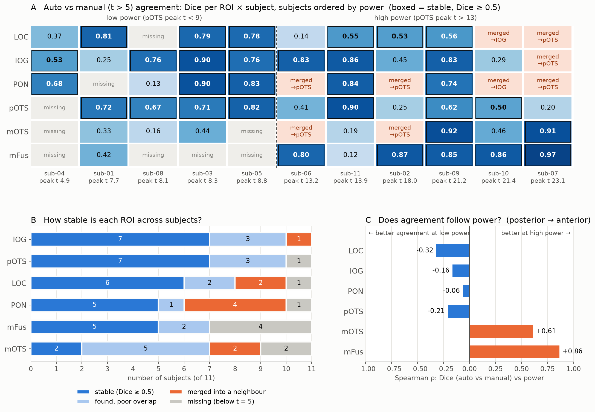

# Auto vs manual (fixed t-threshold) word ROIs — lh, 11 subjects

- **auto:** `label/tiger_ROI_auto/` (auto clusters of RWvsAllNotext_score)
- **manual:** `label/tiger_ROI_manual/` (RWvsAllNotext_mean_raw, fixed threshold)
- **t-map:** `RWvsAllNotext_mean_raw.func.gii`
- **Areas:** mm² on `lh.white`
- **Fixed threshold:** **t > 5**. The lowest t inside every manual label is 5.00–5.20, in every subject.
- **Power marker:** peak t inside the **auto pOTS-words**. Every subject has an auto pOTS.

The script that made these numbers was a scratch file and is not in the repo. Re-run before relying on a value.

## Power ranking

| sub | pOTS peak t | pOTS mean t | vertices t > 5 (hemi) | mFus peak / pOTS peak | manual total mm² | auto total mm² | power |
|---|---|---|---|---|---|---|---|
| 04 | 4.85 | 3.91 | 44 | 0.38 | 33 | 216 | low |
| 01 | 7.70 | 5.33 | 370 | 0.82 | 220 | 606 | low |
| 08 | 8.11 | 4.95 | 193 | 0.09 | 135 | 201 | low |
| 03 | 8.30 | 5.47 | 567 | 0.36 | 258 | 309 | low |
| 05 | 8.83 | 5.68 | 353 | 0.40 | 208 | 353 | low |
| 06 | 13.16 | 9.74 | 1078 | 0.49 | 692 | 469 | high |
| 11 | 13.88 | 10.44 | 708 | 0.38 | 451 | 340 | high |
| 02 | 18.03 | 12.69 | 1457 | 0.48 | 1116 | 487 | high |
| 09 | 21.22 | 14.58 | 1164 | 0.40 | 754 | 427 | high |
| 10 | 21.39 | 12.60 | 2198 | 0.41 | 1532 | 514 | high |
| 07 | 23.15 | 14.64 | 2166 | 0.39 | 1517 | 560 | high |

- **The marker agrees with the visual review.** 01, 03, 04, 05 and 08 were all called low-power or "power problem", and they are the five lowest.
- **The marker agrees with other power measures.** Its rank correlation is 0.93 with the hemisphere's count of vertices above t = 5.
- **Manual ROI size follows power; auto does not.** The manual total area also has a rank correlation of 0.93 with the marker. The auto total area stays at 200–600 mm² regardless of power.

## Area per ROI, auto / manual (mm², – = missing)

| sub | LOC | IOG | PON | pOTS | mOTS | mFus |
|---|---|---|---|---|---|---|
| 01 | 68 / 46 | 92 / 13 | 22 / – | 191 / 107 | 124 / 25 | 108 / 28 |
| 02 | 61 / 167 | 46 / 20 | 87 / – | 121 / **863** | 91 / – | 82 / 66 |
| 03 | 21 / 14 | 57 / 70 | 103 / 125 | 62 / 35 | 55 / 16 | 12 / – |
| 04 | 69 / 16 | 17 / 6 | 21 / 11 | 81 / – | 20 / – | 9 / – |
| 05 | 101 / 74 | 83 / 66 | 19 / 26 | 61 / 43 | 12 / – | 78 / – |
| 06 | 34 / 3 | 64 / 66 | 11 / – | 157 / **599** | 167 / – | 36 / 24 |
| 07 | 64 / – | 147 / – | 116 / – | 159 / **1441** | 13 / 12 | 60 / 64 |
| 08 | 9 / – | 67 / 109 | 65 / 4 | 41 / 21 | 14 / 1 | 5 / – |
| 09 | 93 / 240 | 38 / 54 | 37 / 63 | 108 / 238 | 114 / 133 | 37 / 28 |
| 10 | 54 / – | 115 / **679** | 37 / – | 88 / 267 | 159 / **533** | 60 / 54 |
| 11 | 80 / 209 | 51 / 54 | 71 / 98 | 69 / 84 | 46 / 5 | 25 / 2 |

## What is missing in manual, and why

| sub | power | missing / degraded | why (peak t in the auto ROI) |
|---|---|---|---|
| 04 | low | pOTS, mOTS, mFus missing; LOC, IOG, PON tiny | peak below 5: pOTS 4.85, mOTS 2.96, mFus 1.85 |
| 01 | low | PON missing; IOG, mOTS, mFus shrink to 15–25 % of auto | PON peak 4.09 |
| 08 | low | LOC and mFus missing; mOTS a dot (1 mm²) | LOC 4.23, mFus 0.73; mOTS 5.47, barely above |
| 03 | low | mFus missing | mFus 2.95 |
| 05 | low | mOTS and mFus missing; posterior 3 kept | mOTS 4.79, mFus 3.49 |
| 06 | high | PON and mOTS missing | merged into a pOTS of 599 mm² (auto 157); PON 10.9, mOTS 8.2 |
| 11 | high | all present; mOTS and mFus near-dots (5 and 2 mm²) | mFus peak 5.24, just above 5 |
| 02 | high | PON and mOTS missing | merged into a pOTS of 863 mm² (auto 121); PON 16.8, mOTS 16.5 |
| 09 | high | all present; LOC and pOTS ~2.5× auto | grows, no merge yet |
| 10 | high | LOC and PON missing | merged into an IOG of 679 mm² (auto 115); mOTS 533 mm² with ITG parts |
| 07 | high | LOC, IOG and PON missing | one posterior cluster of 1441 mm² (auto 159), labelled pOTS; peaks 21–28 |

**The merges are confirmed by overlap.** Each high-power ROI that is missing in manual lies 98–100 % inside another manual label:
- sub-02: PON and mOTS lie inside manual pOTS.
- sub-06: PON and mOTS lie inside manual pOTS.
- sub-07: LOC, IOG and PON lie inside manual pOTS.
- sub-10: LOC and PON lie inside manual IOG.

So nothing was missed: the ROIs were absorbed into a neighbour.

## The problem with a fixed threshold

1. **It measures power, not anatomy.** The same t > 5 gives 33 mm² in total in sub-04 and 1532 mm² in sub-10, about 46 times more. Which ROIs exist, and how big they are, depends on SNR.
2. **Low power makes ROIs disappear.** An ROI whose peak t is below 5 cannot appear at all, and the survivors are dots (sub-08 mOTS 1 mm², sub-11 mFus 2 mm²). The anterior ROIs go first.
3. **High power makes ROIs merge.** The suprathreshold area grows across ROI borders, and the fine-grained functional organisation is lost:
   - sub-07: one 1441 mm² blob covering LOC, IOG, PON and pOTS;
   - sub-10: IOG covers LOC and PON;
   - sub-02 and sub-06: pOTS swallows mOTS and PON.
   
   The name then depends on which blob is left. In sub-07 the merged cluster is called "pOTS".
4. **There is a posterior → anterior gradient inside each subject.** mFus peaks at about 0.4 × the pOTS peak (median ratio 0.40). So no single threshold fits both ends:
   - low enough for mFus, and the posterior ROIs merge;
   - high enough to split the posterior ROIs, and mFus vanishes.
   
   sub-11 shows both at once: a clean posterior but a 2 mm² mFus.
5. **The auto method avoids this.** It uses a score relative to each subject's own map, so its ROI sizes stay at 200–600 mm² in total across the whole power range.

**Possible exclusions**, both low power:
- sub-04: its pOTS peak (4.85) is below the threshold itself.
- sub-08: its mFus peak is 0.73.

## Which ROI is most stable, and does that follow power?

**Definitions**
- **Stable:** the manual ROI exists and its Dice overlap with the auto ROI is ≥ 0.5 (area-weighted on `lh.white`).
- **Merged:** the manual ROI is missing, and ≥ 50 % of the auto ROI lies inside another manual label.
- **Missing:** the manual ROI is missing, and the auto ROI is not inside another label (its peak is below t = 5).

| ROI | stable | found (any overlap) | merged | missing | Spearman ρ, Dice vs power |
|---|---|---|---|---|---|
| IOG | **7** | 10 | 1 | 0 | −0.16 |
| pOTS | **7** | 10 | 0 | 1 | −0.21 |
| LOC | 6 | 8 | 2 | 1 | −0.32 |
| PON | 5 | 6 | 4 | 1 | −0.06 |
| mFus | 5 | 7 | 0 | 4 | **+0.86** |
| mOTS | 2 | 7 | 2 | 2 | +0.61 |

- **IOG and pOTS are the most stable** (7 / 11 each). **mOTS is the least** (2 / 11).
- **Only the anterior ROIs follow power.**
  - mFus agrees only in high-power subjects (ρ = +0.86). It is missing in 4 of the 5 low-power subjects.
  - mOTS has ρ = +0.61, which is borderline: ρ ≈ 0.62 is the p < .05 cut-off for n = 11.
- **The posterior ROIs show no reliable dependence on power** (ρ −0.32 to −0.06). They fail at high power by **merging**: PON in 4 subjects, and LOC, IOG and mOTS too.
- **The two failure modes sit at opposite ends.** Low power deletes the anterior end; high power merges the posterior end. No single power level makes all six ROIs agree. The best subject is sub-09 (6 / 6 stable).
- **Caveat:** with only 11 subjects these are descriptive. Only mFus's correlation clears p < .05.
